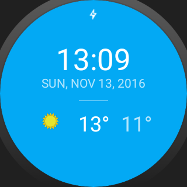

Advanced Android Sample App
===================================

Synchronizes weather information from OpenWeatherMap on Android Phones and Tablets. Used in the Udacity Advanced Android course.

To start using the project just add the following line to gradle.properties file
MyOpenWeatherMapApiKey="YOUR API KEY"

Pre-requisites
--------------
- Android SDK 21 or Higher for app
- Android SDK 23 for wear
- Update MyOpenWeatherMapApiKey in gradle.properties
- Sender ID for GCM in app:strings.xml
- If running on wear emulator, try to use wear with API 23.

References
----------
- Help taken from stackoverflow and blogs like https://catinean.com/2015/03/28/creating-a-watch-face-with-android-wear-api-part-2/

Getting Started
---------------
This sample uses the Gradle build system.  To build this project, use the
"gradlew build" command or use "Import Project" in Android Studio.

Screenshots
-----------

Support
-------

- Google+ Community: https://plus.google.com/communities/105153134372062985968
- Stack Overflow: http://stackoverflow.com/questions/tagged/android

Patches are encouraged, and may be submitted by forking this project and
submitting a pull request through GitHub. Please see CONTRIBUTING.md for more details.

License
-------
Copyright 2015 The Android Open Source Project, Inc.

Licensed to the Apache Software Foundation (ASF) under one or more contributor
license agreements.  See the NOTICE file distributed with this work for
additional information regarding copyright ownership.  The ASF licenses this
file to you under the Apache License, Version 2.0 (the "License"); you may not
use this file except in compliance with the License.  You may obtain a copy of
the License at

http://www.apache.org/licenses/LICENSE-2.0

Unless required by applicable law or agreed to in writing, software
distributed under the License is distributed on an "AS IS" BASIS, WITHOUT
WARRANTIES OR CONDITIONS OF ANY KIND, either express or implied.  See the
License for the specific language governing permissions and limitations under
the License.

